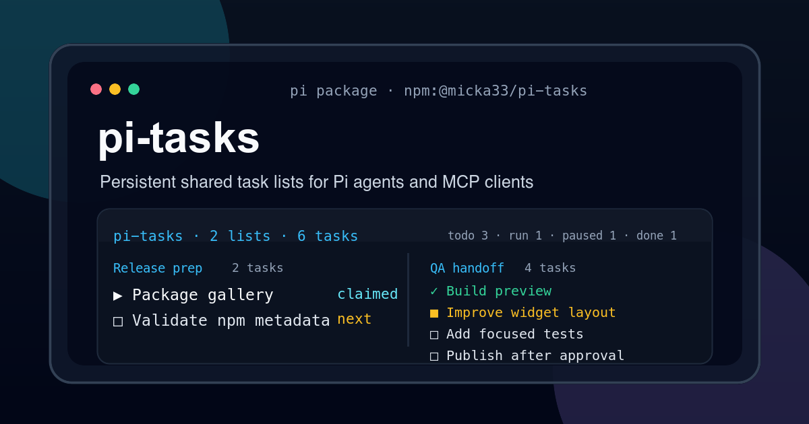

# pi-tasks

Persistent, ordered, shared task lists for Pi agents and MCP clients.



`pi-tasks` ships:

1. a **Pi package/extension** exposing task tools directly inside Pi;
2. a **Pi skill** explaining when and how to use the task tools;
3. a **local stdio MCP server** exposing the same tool surface to MCP hosts.

The product specification is kept in [`pi-tasks.md`](./pi-tasks.md).

## Requirements

- Node.js 24.15.0 exactly. `.node-version` is the runtime source of truth used by GitHub Actions; `package.json`, `package-lock.json`, `.nvmrc`, and `.npmrc` keep local installs strict and synchronized because the implementation uses the built-in `node:sqlite` module.
- Pi for the extension use case.
- An MCP-compatible host for the stdio server use case.

## Install for Pi

From npm, using the latest published release:

```bash
pi install npm:@micka33/pi-tasks@latest
```

For project-local installation:

```bash
pi install -l npm:@micka33/pi-tasks@latest
```

Releases are also mirrored to GitHub Packages so they appear on the repository Packages page. To install from GitHub Packages instead of npmjs.org, configure npm's `@micka33` registry to `https://npm.pkg.github.com` first; GitHub may require a token depending on package visibility and client settings.

From this repository instead of npm:

```bash
pi install git:git@github.com:Micka33/pi-tasks.git@latest
```

During development:

```bash
pi -e ./src/pi/index.ts
```

## SQLite storage

Default database path:

```text
.pi/pi-tasks/tasks.sqlite
```

Override it to share one queue between workspaces, Pi sessions, and MCP clients:

```bash
export PI_TASKS_DB_PATH=/absolute/path/to/tasks.sqlite
```

Same SQLite database + same `list_id` = same shared task list.

## Agent identity

### Pi

The Pi extension derives `agent_id` from the Pi session file:

```text
pi-session:<sha256(session-file)[0..16]>
```

You can override it with:

```bash
export PI_TASKS_AGENT_ID=my-agent
```

### MCP

MCP has no Pi session, so set a stable identity explicitly:

```bash
export PI_TASKS_AGENT_ID=mcp-worker-1
```

If omitted, the MCP server uses a process-scoped fallback; set `PI_TASKS_AGENT_ID` for stable claims across restarts.

## MCP stdio server

Build first:

```bash
npm install
npm run build
```

Run:

```bash
PI_TASKS_AGENT_ID=mcp-worker-1 \
PI_TASKS_DB_PATH=/absolute/path/to/tasks.sqlite \
node dist/src/mcp/cli.js
```

Example MCP config shape:

```json
{
  "mcpServers": {
    "pi-tasks": {
      "command": "node",
      "args": ["/absolute/path/to/pi-tasks/dist/src/mcp/cli.js"],
      "env": {
        "PI_TASKS_AGENT_ID": "mcp-worker-1",
        "PI_TASKS_DB_PATH": "/absolute/path/to/tasks.sqlite"
      }
    }
  }
}
```

## Programmatic API

The npm package exports a public code API from the package root:

```ts
import { PiTasks, type PiTasksOptions } from "@micka33/pi-tasks";
```

`PiTasksOptions` is documented in the emitted declaration file included in npm:

```text
dist/src/public/pi-tasks.d.ts
```

Constructor options:

- `dbPath?: string` — absolute or cwd-relative SQLite database path. If omitted, `PI_TASKS_DB_PATH` is honored first, then pi-tasks uses `<cwd>/.pi/pi-tasks/tasks.sqlite`.
- `cwd?: string` — base directory used when resolving the default database path or a relative `dbPath`. Defaults to `process.cwd()`.
- `agentId?: string` — stable id for the calling agent/integration. If omitted, `PI_TASKS_AGENT_ID` is honored first, then a process-scoped fallback id is generated. Use a stable value when claims or private-list ownership must survive process restarts.
- `source?: "pi" | "mcp" | "test" | "unknown"` — source label stored in access context and returned by `getAgentSummary()`. Defaults to `"unknown"` for the public code API.
- `privateBypass?: { reason: string; toolName: string }` — optional default private-list bypass applied to calls from this instance. Prefer per-call bypasses when the confirmation is specific to one action.
- `now?: () => Date` — clock override for deterministic tests or simulations.

Example:

```ts
const tasks = new PiTasks({
  cwd: repoRoot,
  agentId: "parallel-main:abc123",
  source: "unknown",
});

const list = tasks.ensureTaskList({
  id: "parallel-agent-api-questions",
  name: "parallel questions: api",
  scope_type: "agent",
  scope_key: "api",
  visibility: "shared",
});
```

## Pi TUI widget

The Pi extension shows a compact framed `pi-tasks` widget above the editor when visible task lists exist, including lists that currently contain no tasks.

It summarizes visible lists, status counts, and tasks assigned to or claimed by the current Pi session. The widget puts the current agent's work first, uses readable counters such as `todo 2 · run 1 · blocked 0 · done 0`, and labels blocked tasks as `paused`. It never bypasses private-list protection automatically.

Control it with:

```text
/task-widget on
/task-widget off
/task-widget compact
/task-widget full
/task-widget refresh
```

Useful commands:

```text
/task-lists            # compact: only name + id
/task-lists full       # complete JSON metadata
/tasks <list_id>       # readable task details, including ids, agents, times, descriptions, notes, outcome
/tasks <list_id> full  # complete JSON for the list and tasks
/task-audit [list_id]  # readable private-list bypass audit events visible to this agent
/task-audit [list_id] full # complete JSON audit events
/task-list-delete <list_id> # soft-delete a list and all active tasks in it
/task-language en|fr  # change Pi UI language for this session
```

`/tasks <list_id>`, `/task-audit <list_id>`, and `/task-list-delete <list_id>` support Pi TUI autocomplete for visible task-list ids. Type `/tasks ` then trigger completion, or start typing a list id/name to filter suggestions. `/task-widget` autocompletes its actions: `on`, `off`, `compact`, `full`, `refresh`. `/task-language` autocompletes supported UI languages: `en`, `fr`, `de`, `es`, `it`, `pl`, `ru`, `jp`, `cn`.

The widget refreshes on session start, after `task_*` tool calls, and periodically every 10 seconds to catch updates made by other agents or MCP clients.

Pi currently renders at most 10 widget lines. `pi-tasks` stays under that limit itself to avoid Pi's generic `widget truncated` message: compact mode uses up to 8 lines, full mode uses up to 10 lines, and hidden content is summarized with explicit `… masquée(s)` lines plus `/tasks <list_id>` hints.

## Pi UI language

Human-facing Pi UI text is localized. Supported locales are `en`, `fr`, `de`, `es`, `it`, `pl`, `ru`, `jp`, and `cn`.

Change it for the current Pi session with autocomplete:

```text
/task-language fr
/task-language en
/task-language de
/task-language es
/task-language it
/task-language pl
/task-language ru
/task-language jp
/task-language cn
```

You can also choose a startup default with:

```bash
export PI_TASKS_LANG=fr
# or
export PI_TASKS_LANG=en
```

If `PI_TASKS_LANG` is unset, `pi-tasks` tries `LC_ALL`, `LC_MESSAGES`, then `LANG`, and falls back to `en`. The `/task-language` command overrides that fallback for the current process/session. Use `/task-widget refresh` after changing language to redraw the widget; command/tool labels already registered by Pi may require `/reload`. Tool names, action names, JSON fields, status values, IDs, and structured tool results stay stable and are not translated.

## Tools

`pi-tasks` exposes a compact tool surface. Each tool takes an `action` plus an optional action-specific `params` object:

- `task_lists` — `create`, `find`, `get`, `delete` task lists.
- `task_items` — `create`, `add_many`, `update`, `reorder`, `delete` tasks.
- `task_claims` — `claim_next`, `refresh`, `release_expired` claims.
- `task_audit` — `get` private-list bypass audit events visible to the current agent.
- `task_help` — required reference tool for workflow rules, action schemas, and examples (`action`: `all`, `workflow`, `schemas`, or `examples`).

Structured results are wrapped to make compact actions obvious in the model-visible tool content, Pi `details`, and MCP output. Every compact `tool+action` combination has a dedicated short Pi UI renderer, without removing full ids or fields from the data available to agents/MCP:

```text
✓ 2 listes trouvées
  NAME            VISIBILITY  ID
• Task flow demo  shared      task-flow-demo-20260510

Task flow demo · shared · 3 tâches
todo 2 · run 1

  #  STATUS  ID        TITLE
• 1  run     d813c1f6  Préparer le contexte
• 2  todo    8d55eb15  Exécuter le traitement
• 3  todo    c5fbf6bf  Contrôler le résultat

▶ Tâche claimée: #1 Préparer le contexte
  status: in_progress · expires: ~2h · id: d4fb8a30

✓ Claim rafraîchi: #1 Préparer le contexte
  status: in_progress · expires: ~2h · id: d4fb8a30

Private access audit · 1 événement
  TIME                  LIST          ACTOR    TOOL
• 2026-01-01 00:30:00Z  private-list  agent-b  task_lists.get
  reason: User confirmed bypass
```

Full structured envelope:

```json
{
  "operation": "task_items.add_many",
  "tool": "task_items",
  "action": "add_many",
  "result": []
}
```

Examples:

```json
{ "action": "find", "params": { "scope_type": "workspace", "scope_key": "/repo" } }
{ "action": "claim_next", "params": { "list_id": "release-work" } }
{ "action": "update", "params": { "task_id": "task-id", "status": "done", "outcome": "Decision: ship. Actions: tests. Final state: green." } }
```

## Important workflow rule

`task_claims` with `action="claim_next"` is the only normal way to move a task to `in_progress`.

`task_items` with `action="update"` and `status="in_progress"` is rejected intentionally to avoid multi-agent conflicts.

For long tasks, call `task_claims` with `action="refresh"` periodically. The default TTL is 2 hours.

When pausing a task with `task_items` `action="update"` and `status="blocked"`, the active claim is cleared but responsibility is kept by default: if `assigned_to_agent_id` is omitted, `pi-tasks` sets it to the agent that paused the task. To fully release the paused task, pass `assigned_to_agent_id: null` in the same update call. To hand it off, pass another agent id.

Use `notes` as task-local working memory while a task is in progress: important context, choices in progress, blockers, assumptions, and next steps belong there.

`outcome` is the final deliverable, conclusion, or summary for a completed or canceled task. Closing a task with `status="done"` or `status="canceled"` requires a non-empty `outcome`; summarize the choices/decisions made, actions taken, and final state obtained.

## Privacy model

Private lists are enforced strictly:

- shared lists are visible to all agents using the database;
- private lists are accessible only to `owner_agent_id`, or to `created_by_agent_id` when no owner is set;
- Pi can bypass after an explicit user confirmation dialog;
- MCP tries form elicitation when the host supports it, otherwise returns an access error.

Bypasses are audited in SQLite in `private_access_events`. Read them with `/task-audit [list_id] [full]` in Pi, or `task_audit` with `action="get"` in Pi/MCP. Reading audit events follows the same privacy model: list-specific reads require access to that list or an explicit user-confirmed bypass; global reads return only events for lists visible to the current agent.

## Development

Use Node.js 24.15.0 before installing dependencies. With `nvm`:

```bash
nvm use
npm install
npm run typecheck
npm test
npm run coverage
```

`npm run coverage` calls `scripts/check-coverage.mjs`, the same helper used by GitHub CI. It builds the project, runs the Node test runner with coverage enabled, and enforces 100% thresholds for lines, branches, and functions.

The test suite covers SQLite persistence, claim uniqueness, claim refresh, soft-delete, private-list enforcement, status rules, command formatting, widget formatting, and autocomplete helpers.

## Releases

A GitHub Release and npm publication are created automatically when a semver tag is pushed. The package version used in npm and in the release artifact is derived from the tag, so releasing does not require committing a package version bump.

```bash
git tag -a v0.0.1 -m "pi-tasks 0.0.1"
git push origin v0.0.1
```

The workflow reads Node.js from `.node-version`, builds `dist/` on the runner, tests, runs `npm pack`, publishes that exact tarball to the public npm registry as `@micka33/pi-tasks` using the `NPM_ACCESS_TOKEN` GitHub secret, publishes the same tarball to GitHub Packages using the workflow `GITHUB_TOKEN`, updates the `latest` dist-tag on both registries, uploads the `.tgz` artifact and its SHA256 checksum to the GitHub Release, and force-updates the movable git tag `latest` to the released commit. `NPM_ACCESS_TOKEN` must be an npm token allowed to publish packages in the `micka33` npm organization (for accounts with 2FA, use an automation/granular publish token). The workflow also requires `packages: write` permission so `GITHUB_TOKEN` can publish to `https://npm.pkg.github.com`. `dist/` is intentionally ignored by git; release artifacts include the generated runtime build.

The npm tarball is intentionally minimal: `bin/pi-tasks-mcp.js`, `dist/`, `README.md`, and `package.json`. `package-lock.json` stays in git for reproducible development installs; npm excludes package locks from published package tarballs.
